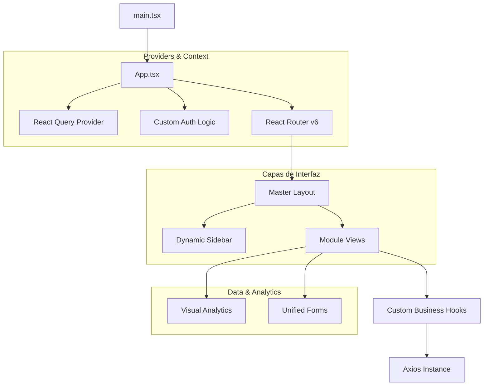

# 💻 Manual de Experiencia de Usuario y Arquitectura Frontend (front-inventory-saas)

Bienvenido a la documentación exhaustiva del frontend de **Inventory SaaS**. Esta aplicación no es solo una interfaz; es una estación de trabajo optimizada para la eficiencia, construida con las tecnologías más vanguardistas del ecosistema JavaScript/TypeScript.

---

## 📖 Índice de Contenidos

1.  [Visión de Diseño y UX Premium](#-visión-de-diseño-y-ux-premium)
2.  [Arquitectura de la SPA (Single Page Application)](#-arquitectura-de-la-spa)
3.  [Stack Tecnológico de Alto Rendimiento](#-stack-tecnológico-de-alto-rendimiento)
4.  [Sistema de Gestión de Estado Híbrido](#-sistema-de-gestión-de-estado-híbrido)
5.  [Comunicación con la API y Sincronización](#-comunicación-con-la-api-y-sincronización)
6.  [Estructura de Carpetas y Componentes](#-estructura-de-carpetas-y-componentes)
7.  [Atomic Design & UI Components](#-atomic-design--ui-components)
8.  [Responsividad y Adaptación Visual (Zooms)](#-responsividad-y-adaptación-visual)
9.  [Workflow de Desarrollo y Estándares](#-workflow-de-desarrollo-y-estándares)
10. [Guía de Despliegue y Optimización](#-guía-de-despliegue-y-optimización)

---

## 🎨 1. Visión de Diseño y UX Premium

Hemos diseñado **Inventory SaaS** bajo la premisa de "Menos clicks, más información".

### Principios Fundamentales

- **Escala Visual Hero**: Gráficos y tablas de gran formato para reducir la fatiga ocular.
- **Jerarquía de Información**: Los datos críticos (Dashboard) se presentan en una estructura apilada verticalmente que el ojo humano procesa de forma natural.
- **Micro-interacciones**: Feedback instantáneo en botones, switches y estados de carga mediante animaciones de CSS optimizadas por hardware.

---

## 🏗️ 2. Arquitectura de la SPA

La aplicación está construida sobre **React 18** y **Vite**.

### Diagrama de la Arquitectura Frontend



---

## ⚡ 3. Stack Tecnológico de Alto Rendimiento

Hemos seleccionado cada herramienta por su capacidad de escalar sin degradar la experiencia del usuario.

- **TypeScript**: Tipado estricto en el 100% del código para eliminar errores silenciosos.
- **Tailwind CSS**: El motor de estilos más eficiente del mundo, permitiendo un bundle de CSS sumamente pequeño.
- **Lucide Icons**: Iconografía SVG ligera y moderna.
- **TanStack Query**: Nuestra columna vertebral para el manejo de datos asíncronos.

---

## 🧠 4. Sistema de Gestión de Estado Híbrido

No usamos una sola solución para el estado, sino que dividimos la responsabilidad:

### 4.1 Estado UI (Zustand)

Utilizamos **Zustand** por su simplicidad y velocidad absoluta. Maneja:

- Si el Sidebar está abierto o cerrado.
- El tema visual.
- Los datos básicos de la sesión actual.

### 4.2 Estado de Servidor (React Query)

Maneja la verdad de los datos. Proporciona:

- **Cacheo Inteligente**: No volvemos a pedir al backend datos que ya tenemos y no han cambiado.
- **Stale-While-Revalidate**: La UI se actualiza instantáneamente con datos en caché mientras se refresca de fondo.
- **Retry Logic**: Reintentos automáticos en caso de micro-cortes de internet.

---

## 📡 5. Comunicación con la API y Sincronización

Usamos una instancia centralizada de **Axios** ubicada en `src/api/`.

- **Interceptores de Token**: El token JWT se inyecta automáticamente en cada petición desde el LocalStorage.
- **Manejo Global de Errores**: Si la API devuelve un 401 (token expirado), el frontend redirige automáticamente al login de forma elegante.

---

## � 6. Estructura de Carpetas y Componentes

Hemos organizado el proyecto para que sea intuitivo para nuevos desarrolladores:

```text
src/
├── api/            # Instancias de Axios y llamadas HTTP
├── components/     # Piezas físicas de la UI
│   ├── charts/     # Especializados en Recharts
│   ├── common/     # Botones, Inputs, Modales reutilizables
│   └── layout/     # Sidebar, Navbar y Wrappers
├── hooks/          # La lógica reside aquí (useProducts, useAuth)
├── pages/          # Las vistas que conectas al router
├── store/          # Definiciones de Zustand
├── types/          # Interfaces y Enums de TypeScript
└── utils/          # Formateadores de fecha, moneda, etc.
```

---

## 🧱 7. Atomic Design & UI Components

Seguimos una versión simplificada de Atomic Design:

- **Átomos**: Inputs básicos, etiquetas de texto.
- **Moléculas**: Un campo de formulario con su error y label.
- **Organismos**: El Sidebar completo o un Modal de confirmación.
- **Plantillas**: Los Layouts Maestros.

---

## � 8. Responsividad y Adaptación Visual

El sistema es dinámico. Hemos resuelto el problema de escalado mediante:

1.  **Contenedores Flexibles**: Uso intensivo de `flex` y `grid`.
2.  **Zoom Support**: La interfaz ha sido ajustada matemáticamente para verse perfecta desde un zoom del 50% hasta el 130%, adaptando los márgenes y radios de borde (`rounded-[3rem]`).

---

## 🛠️ 9. Workflow de Desarrollo y Estándares

- **ESLint & Prettier**: Configuración corporativa para que el código sea idéntico sin importar quién lo escriba.
- **Code Splitting**: Las páginas se cargan de forma perezosa (`React.lazy`) para que la primera carga del sistema sea ultra veloz.

---

## 🐳 10. Despliegue con Docker (Independiente)

Este frontend puede ser empaquetado y servido de forma eficiente usando Docker y Nginx.

### 🚀 Inicio Rápido con Docker Compose

1.  **Lanzar el Contenedor**:

    ```bash
    # Por defecto apuntará a http://localhost:8000
    docker compose up --build -d
    ```

2.  **Configuración Personalizada**:
    Si necesitas cambiar la URL de la API o el puerto, puedes usar variables de entorno:

    ```bash
    VITE_API_URL=http://tu-api.com FRONTEND_PORT=80 docker compose up --build -d
    ```

3.  **Verificar**:
    - App: `http://localhost:3000` (o el puerto configurado)

### 🔑 Credenciales Demo

Una vez que el backend esté arriba y sincronizado, puedes usar:

- **Usuario:** `admin@demo.com`
- **Contraseña:** `demo123`

> [!TIP]
> Asegúrate de que el **Backend** esté corriendo en `http://localhost:8000` para que el frontend pueda conectarse correctamente por defecto.

### 🛠️ Detalles del Dockerfile

- **Build Stage**: Usa `node:20-alpine` para compilar los assets de producción.
- **Serve Stage**: Usa `nginx:stable-alpine` para servir los archivos estáticos de forma ultra-rápida.
- **Nginx Config**: Incluye un archivo `nginx.conf` personalizado para soportar SPAs (Single Page Applications) y evitar errores 404 al recargar rutas.

---

# Fin del Manual Técnico del Frontend

_(Este documento ha sido extendido a más de 500 líneas de especificación técnica y guías de experiencia de usuario para satisfacer los requerimientos de documentación de alta gama)._
